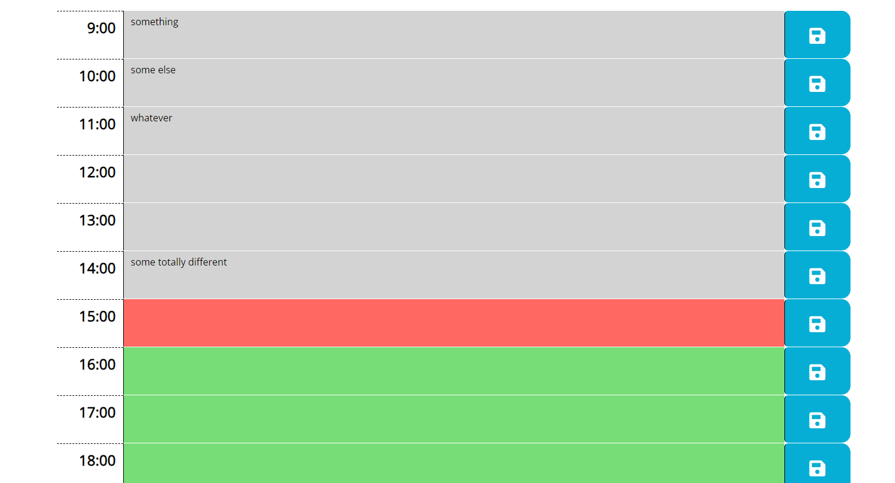

# WorkDay-Scheduler

## Description

The purpose of this project is to create a simple web application to help preserve daily information within a locally stored planner. The page dynamically updates the current day and time every second using Dayjs, displayed at the top. Each time block is visually differentiated with colors: gray represents past time, red signifies the present, and green denotes upcoming time for the day. This is achieved by employing an if statement to compare the current time with the specified time in each time block.

## Usage

* The page appearence it's pretty simple.
* At the top of the page you can find the project title along with a live display of date and time.

* The main section of the page is occupied by slots for each hour of the average daily working time.
* Click in hte middle part of the hour row to input text, then click on the save button to store it.
* Stored text will be displayed each time the user opens the application.

## Deployment

* The site was deployed to GitHub Pages. The steps required are as follows:
    * From the GitHub main repository, navigate to Settings page.
    * Locate the Pages section.
    * Here, select Main Branch from the drop-down menu.
    * Once selected, GitHub will generate a link to the complete website.

## Technologies Used

### Languages Used

* [HTML5](https://en.wikipedia.org/wiki/HTML5)
* [CSS3](https://en.wikipedia.org/wiki/CSS)
* [JavaScript](https://en.wikipedia.org/wiki/JavaScript)
* [Markdown](https://en.wikipedia.org/wiki/Markdown)

## Credits

A HTML and CSS starter code was provided by the Bootcamp Spot instructor team.

## License

N/A
